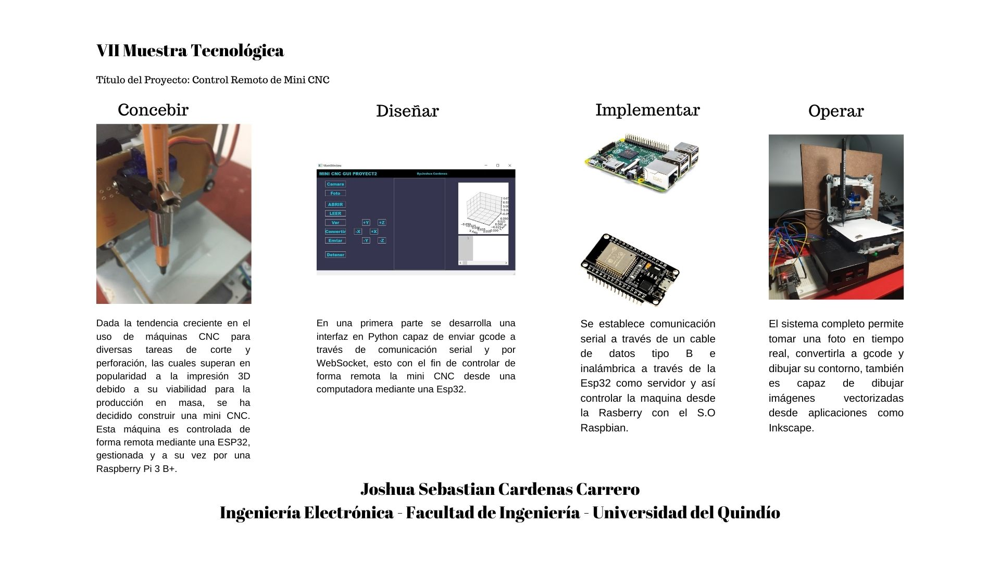
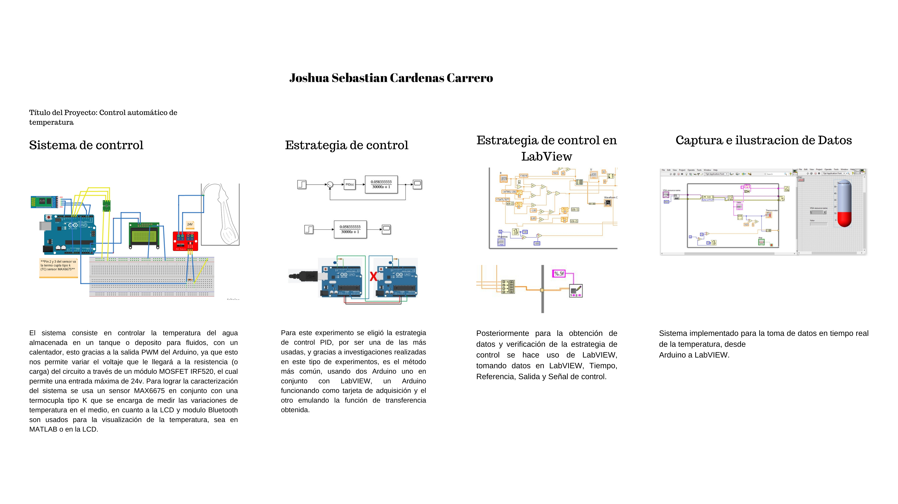
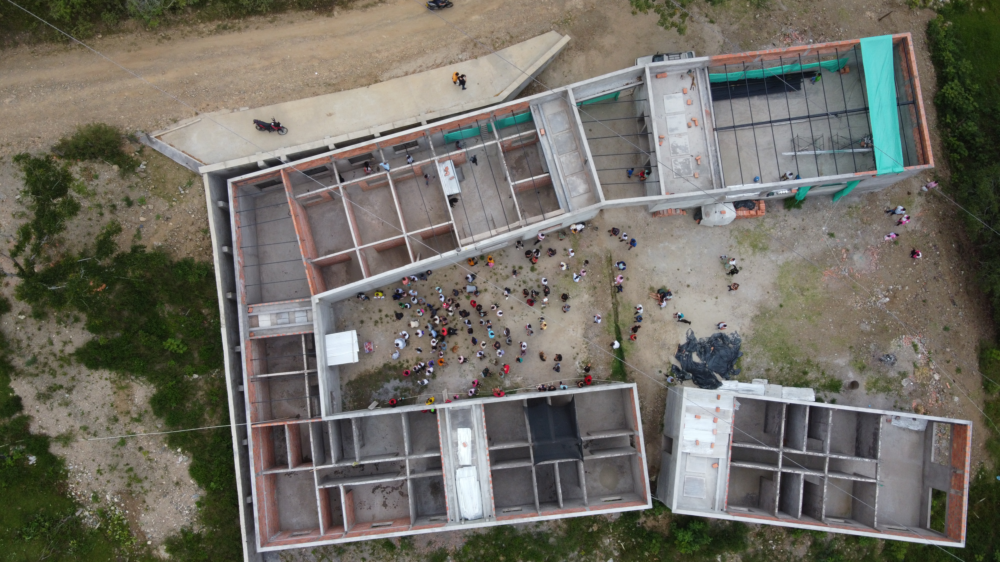
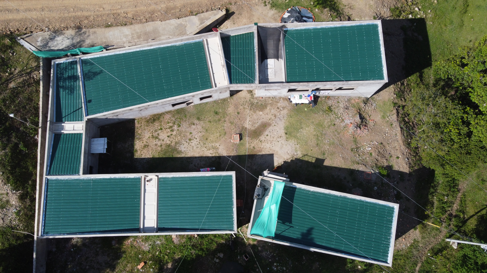

## Data Engineer
Electronics Engineer with experience in programming and data analysis, seeking to transition into the field of Data Science. Proficient in Python and analytical tools, with a background in multidisciplinary projects involving system control and performance evaluation. Passionate about using data to solve complex problems and drive innovation.

## Technical skills and interests
- Languages: C/C++, Python, Javascript-Kotlin, HTML,
- Libraries: C++ STL, Python Libraries, ReactJs
- Web Dev Tools: Nodejs, VScode, Git, Github
- Frameworks: ReactJs
- Cloud/Databases:MongoDb, Firebase, Relational Database(mySql)
- Relevant Courses: Cybersecurity, AWS, PMI, Matlab, LATEX, RETIE.
- Areas of interest: Web design, Video game design, Research and Development.
- Soft Skills: Problem solving, Self-learning, Presentation, Adaptability, Creativity, Management of time, Leadership.

## Education
- Electronic Egineer | The University of Quindío (License No. EC206-179481)
- Certificate in RETIE Standard | Medellín (Registered in Act Book No. 0020240611)
- Certificate in University Teaching and Didactics | Medellín (Registered in Act Book No. 0020240823)						       		

## Work Experience
**Teaching Assistant, organic materials laboratory in the interdisciplinary science laboratory (_Feb - Jun 2023_)**

- Warmer application update to android (Java-Kotlin), Front End.
- CNC machine conditioning.
- Design of topologies and applications for the oxidized carbon-based transistor.

**Product Manager CDIO 2 and CDIO 3 (_Sep 2022 - Dec 2023_)**
- Management, administration, evaluation and control of activities with agile methodologies, supported by a Kanban board.
- Violeta Project: Implementation of an alarm device in cases of gender violence.
- Col-Equipments: Design of maintenance plan for laboratory equipment under RCM parameters.

## Projects

**CNC machine**
- Drawing images or circuits using Gerber language.
- Design and construction of a CNC machine controlled from a Raspberry pi 3 with raspbian.
- Design of an interface in python to control the movements of the machine.
Technology used: Python, Wi?, Raspberry, ESP32, Inkscape.

  
Project Infographic

  

    

      
    

  

**5G SA Network with Open5gs and srsRAN**

- Implementation of a 5G network using srsRAN, ZMQ and Open5GS.
- Evaluated performance, bandwidth, latency and capacity to handle concurrent users.
- Scalability and flexibility analysis.
Technology used: Linux, Python, IP Addressing, Open5gs and srsRAN.

- [Project Guide](https://github.com/JsCc-Electro/5G-SA-Network-Open5gs-srsRAN)

**Temperature control in liquids**
- Temperature control, monitoring and stabilization.
- Implementation of two Arduinos, as data acquisition card and PID control respectively.
Technology used: C, Arduino uno, LabView, Digital Dimmer.

  
Project Infographic

  

    

      
    

  

## Positions of responsibility

  
3D Design and Modeling Engineer, Select Joinery (Sydney, Australia - Remote) (January 2025 - February 2025)

  <ul>
    <li>Responsible for the 3D design and modeling of residential remodeling projects.</li>
    <li>Utilized SketchUp to create 3D models and photorealistic renders.</li>
    <li>Developed technical drawings with human-scale measurements.</li>
    <li>Applied engineering principles to ensure accuracy and efficiency in design.</li>
  </ul>

  
Drone Operator, Geriatric Home (Rioblanco, Tolima) (December 2023 - January 2025)

  <ul>
    <li>Conducted construction inspection, land mapping, event recording, and project monitoring.</li>
    <li>Processed images to obtain area measurements and detect possible anomalies.</li>
  </ul>
  <!-- Contenedor para las imágenes -->
  

    

      
    

    

      
    

    

      
    

  

  
Geriatric Home Construction Supervisor (Rioblanco, Tolima) (December 2023 - January 2025)

  <ul>
    <li>Coordinated the activities of workers, subcontractors, and suppliers.</li>
    <li>Kept detailed records of activities, progress reports, and design changes.</li>
  </ul>

  
Legal Representative, Electro Tech Integral (November 8 - Present)

  <ul>
    <li>Responsible for the legal representation of the company, managing contract execution, strategic decision-making, and ensuring regulatory compliance to support company growth and operations.</li>
  </ul>

  
Community Manager, Palabras que sanan Padre Andres (July 2024 - January 2025)

  <ul>
    <li>Responsible for the comprehensive management of social networks, including content creation, event planning and execution, coordination of financial flows from social platforms to corporate accounts, and administration of advertising campaigns.</li>
  </ul>

  
Project Manager, San Miguel Residential Development (Rioblanco, Tolima) (September 2024 - December 2024)

  <ul>
    <li>Led comprehensive project planning and resource management to ensure efficient, on-schedule development, overseeing contracts, budgets, and administrative decisions essential for successful lot sales and community establishment.</li>
    <li>Developed and implemented targeted marketing campaigns to promote the development, coordinating with stakeholders to drive visibility and engagement among potential buyers.</li>
  </ul>

  
Technology and Digital Security Coordinator, Sole Notary (Rioblanco, Tolima) (June 2023 - May 2024)

  <ul>
    <li>Comprehensive management of technological systems, including installation and maintenance of equipment (printers, cameras, software), and consulting on strategic decisions.</li>
  </ul>

  
Amazon Kindle Editor (January 2024 - June 2024)

  <ul>
    <li>Designed and created attractive, professional book covers, enhancing the visibility and appeal of the final product.</li>
    <li>Added essential missing content, ensuring the published material is complete and coherent.</li>
    <li>Reorganized books by chapters and sections, optimizing the structure for a better reading experience.</li>
  </ul>

